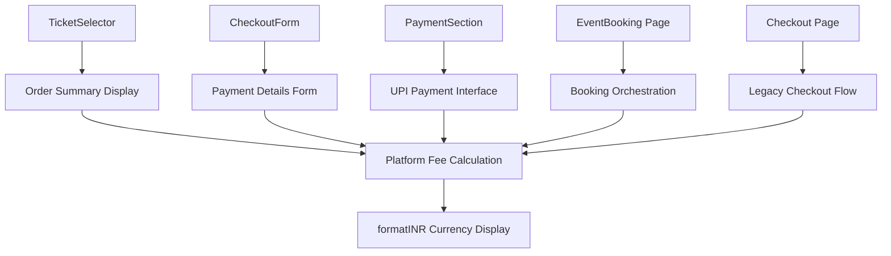
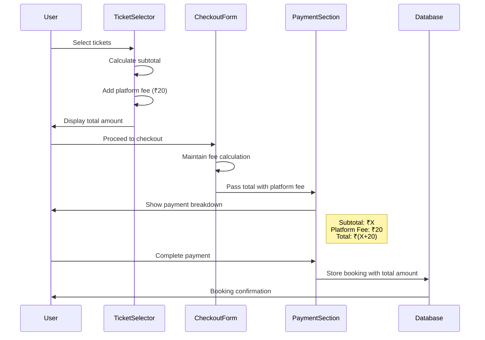
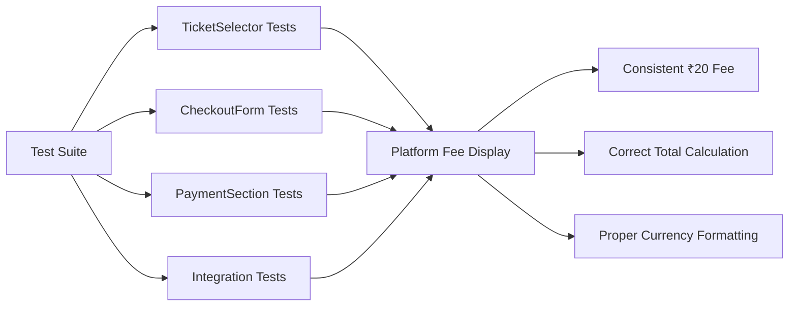

# Platform Fee Implementation Design

## Overview

This design document outlines the implementation of a consistent 20 rupees platform fee across the Neon Drip Beats event ticketing system. The platform fee is applied to all ticket bookings and is prominently displayed in Order Summary, Payment Instructions, and Amount to Pay sections throughout the booking flow.

## Technology Stack & Dependencies

- **Frontend Framework**: React 18.3.1 with TypeScript
- **Styling**: Tailwind CSS for responsive UI
- **State Management**: React hooks and context
- **Currency Formatting**: Custom `formatINR` utility function
- **Backend Integration**: Supabase for booking data persistence

## Component Architecture

### Core Components with Platform Fee Integration



### Component Definitions

#### 1. TicketSelector Component
- **Location**: `/src/components/booking/TicketSelector.tsx`
- **Responsibility**: Primary ticket selection interface with order summary
- **Platform Fee Integration**: 
  - Displays platform fee as separate line item
  - Calculates and shows final "Amount to Pay"
  - Uses constant `PLATFORM_FEE = 20`

#### 2. CheckoutForm Component  
- **Location**: `/src/components/booking/CheckoutForm.tsx`
- **Responsibility**: Multi-step checkout process (details → payment → confirmation)
- **Platform Fee Integration**:
  - Maintains consistent fee calculation across steps
  - Passes fee amount to PaymentSection component
  - Stores total amount including platform fee in booking records

#### 3. PaymentSection Component
- **Location**: `/src/components/booking/PaymentSection.tsx`
- **Responsibility**: UPI payment interface with detailed amount breakdown
- **Platform Fee Integration**:
  - Shows itemized breakdown: Subtotal + Platform Fee = Total
  - Displays exact amount in payment instructions
  - Validates payment amount includes platform fee

#### 4. EventBooking Page
- **Location**: `/src/pages/EventBooking.tsx`
- **Responsibility**: Main booking flow orchestration
- **Platform Fee Integration**:
  - Coordinates platform fee across all booking steps
  - Maintains fee consistency in order summary sidebar

#### 5. Checkout Page (Legacy)
- **Location**: `/src/pages/Checkout.tsx`
- **Responsibility**: Alternative checkout flow via URL parameters
- **Platform Fee Integration**: 
  - Currently missing platform fee implementation
  - Requires enhancement for consistency

## Data Models & Pricing Logic

### Platform Fee Constants

```typescript
// Consistent across all components
const PLATFORM_FEE = 20; // Fixed 20 rupees platform fee
```

### Pricing Calculation Pattern

```typescript
// Standard calculation logic used across components
const getSubtotal = () => {
  return selectedTickets.reduce((total, ticket) => 
    total + (ticket.price * ticket.quantity), 0
  );
};

const getTotalAmount = () => {
  return getSubtotal() + PLATFORM_FEE;
};
```

### Currency Formatting

```typescript
// formatINR function handles Indian Rupee formatting
formatINR(value: number) => "₹XX,XXX.00"
```

## Business Logic Architecture

### Platform Fee Application Flow



### Fee Display Strategy

1. **Order Summary Section**
   - Ticket Subtotal: `₹{subtotal}`
   - Platform Fees: `₹20`
   - Amount to Pay: `₹{total}` (emphasized with larger font/primary color)

2. **Payment Instructions Section**
   - "Enter the exact amount: ₹{total}"
   - Breakdown displayed for transparency

3. **Mobile Sticky Footer**
   - "Total: ₹{total}" for quick reference

## Component Integration Patterns

### Props Interface Standardization

```typescript
interface PlatformFeeProps {
  subtotal: number;
  platformFee: number; // Always 20
  totalAmount: number; // subtotal + platformFee
}
```

### State Management Pattern

```typescript
// Consistent state management across components
const [selectedTickets, setSelectedTickets] = useState<SelectedTicket[]>([]);
const PLATFORM_FEE = 20;

const getSubtotal = useCallback(() => {
  return selectedTickets.reduce((total, ticket) => 
    total + (ticket.price * ticket.quantity), 0
  );
}, [selectedTickets]);

const getTotalAmount = useCallback(() => {
  return getSubtotal() + PLATFORM_FEE;
}, [getSubtotal]);
```

## Styling Strategy

### Visual Hierarchy for Platform Fee Display

```css
/* Order Summary Styling Pattern */
.order-summary {
  @apply bg-primary/5 rounded-lg p-4;
}

.fee-line-item {
  @apply flex justify-between text-sm text-muted-foreground;
}

.total-amount {
  @apply flex justify-between font-semibold;
}

.amount-to-pay {
  @apply text-primary text-lg; /* Emphasized total */
}
```

### Responsive Design Considerations

- Desktop: Side-by-side layout with order summary in sidebar
- Mobile: Sticky footer with condensed total display
- Tablet: Adaptive layout maintaining fee visibility

## Integration Testing Strategy

### Unit Test Coverage

1. **Platform Fee Calculation Tests**
   ```typescript
   describe('Platform Fee Calculations', () => {
     it('should add 20 rupees platform fee to subtotal', () => {
       expect(getTotalAmount(100)).toBe(120);
     });
     
     it('should display formatted currency correctly', () => {
       expect(formatINR(120)).toBe('₹120.00');
     });
   });
   ```

2. **Component Integration Tests**
   - Verify platform fee appears in all required sections
   - Test platform fee consistency across navigation
   - Validate payment amount includes platform fee

3. **User Flow Tests**
   - End-to-end booking with platform fee verification
   - Payment screenshot upload with correct total
   - Booking confirmation with accurate amounts

### Cross-Component Validation



## Enhancement Opportunities

### Current Implementation Gaps

1. **Checkout Page Platform Fee**
   - Legacy checkout flow needs platform fee integration
   - Requires addition of platform fee to existing total calculation
   - Should maintain consistency with main booking flow

2. **Platform Fee Configuration**
   - Consider extracting platform fee to environment configuration
   - Enable dynamic fee updates without code changes
   - Support for percentage-based fees in future

3. **Enhanced Fee Transparency**
   - Add fee explanation tooltip or modal
   - Include fee breakdown in booking confirmation emails
   - Consider fee exemptions for certain ticket types

### Future Scalability Considerations

1. **Variable Platform Fees**
   ```typescript
   interface PlatformFeeConfig {
     amount: number;
     type: 'fixed' | 'percentage';
     exemptTicketTypes?: string[];
   }
   ```

2. **Multi-Currency Support**
   - Extend formatINR to support multiple currencies
   - Platform fee conversion for international events

3. **Fee Analytics**
   - Track platform fee revenue
   - A/B testing for fee amount optimization